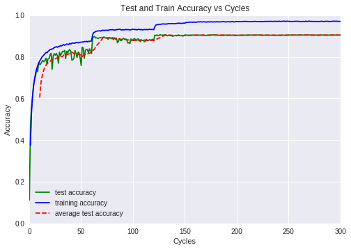
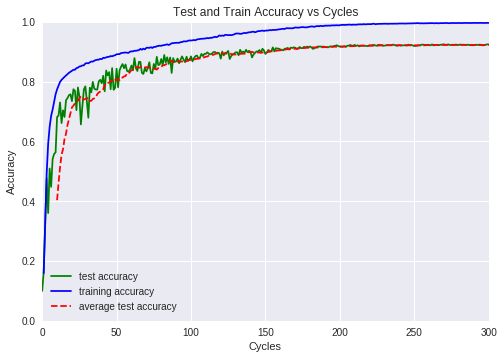

# A PyTorch (0.3.0) Implementation of DenseNet

This is a [PyTorch](http://pytorch.org/) implementation of the
Residual Network architecture with basic blocks as described
paper [Deep Residual Learning for Image Recognition](https://arxiv.org/abs/1512.03385)
by Kaiming He, Xiangyu Zhang, Shaoqing Ren and Jian Sun.
This implementation gets a CIFAR10 test accuracy of %91-92 percent
when 18 layers are used (in the paper they achieve %93 percent, this might
be because they prep the dataset with whitening. Different annealing schemes or 
changing the order of the batchnorm and relu does not make any significant 
changes. SGD with a decreasing learning rate seems to perform the
best among all optimizers. Applying random rotations, flips and ctops to the training set
at the beginning of each cycle to boost the variety in training set seems to improve
the accuracy by about %1-2 percent.

# Architectural details

The network contains 4 stages of residual blocks. The number of residual 
blocks inside each stage as well as the initial width of the first block
can be given as inputs to the network constructer. The width then increases 
as 3 -> width -> 2*width -> 4*width -> 8*width. Convolution shortcut connections
are used as the "identity" mappings. 

# Implementation details

The code has been implemented for pytorch 0.3. So if you want to run it in 
pytorch 0.4 you need to change the way some scalars are handled (in particular
change .sum() to .sum().item() and .data[0] to .item()). Random rotations and flips

# Graphs of accuracy

Implementation of ResNet18 with time step learning rate. Details:
Best test accuracy: 0.90660, training accuracy: 0.96980 (cost:0.09425)
Class: plane, Precision:0.89, Recall: 0.92, F1 norm: 0.90  
Class: car  , Precision:0.96, Recall: 0.95, F1 norm: 0.96  
Class: bird , Precision:0.88, Recall: 0.85, F1 norm: 0.87  
Class: cat  , Precision:0.81, Recall: 0.82, F1 norm: 0.81  
Class: deer , Precision:0.90, Recall: 0.91, F1 norm: 0.90  
Class: dog  , Precision:0.85, Recall: 0.86, F1 norm: 0.85  
Class: frog , Precision:0.94, Recall: 0.92, F1 norm: 0.93  
Class: horse, Precision:0.95, Recall: 0.93, F1 norm: 0.94  
Class: ship , Precision:0.95, Recall: 0.95, F1 norm: 0.95  
Class: truck, Precision:0.93, Recall: 0.94, F1 norm: 0.94  

Implementation of ResNet18 with exponentially decreasing learning rate. Details:
Best test accuracy: 0.91490, training accuracy: 0.98218 (cost:0.06073)
Class: plane, Precision:0.93, Recall: 0.90, F1 norm: 0.91  
Class: car  , Precision:0.95, Recall: 0.96, F1 norm: 0.96  
Class: bird , Precision:0.89, Recall: 0.87, F1 norm: 0.88  
Class: cat  , Precision:0.83, Recall: 0.82, F1 norm: 0.82  
Class: deer , Precision:0.90, Recall: 0.93, F1 norm: 0.91  
Class: dog  , Precision:0.87, Recall: 0.89, F1 norm: 0.88  
Class: frog , Precision:0.94, Recall: 0.94, F1 norm: 0.94  
Class: horse, Precision:0.96, Recall: 0.92, F1 norm: 0.94  
Class: ship , Precision:0.92, Recall: 0.96, F1 norm: 0.94  
Class: truck, Precision:0.94, Recall: 0.94, F1 norm: 0.94  

Note that a high precision, low recall for an object X means that the network is very cautious 
about this object. So for many objects which are X, the network might say "this is not X", but if it says
it is "X" then it is very likely to be correct. So it is true guesses are very precise but can not 
recall most X.

A high recall but low precision for an object X means that the network is very good at finding all the objects
which are X but it overshoots. So it identifies most of all the objects X as X but it also identifies many other
which are not X as X as well. So it is not very precise but recalls all the X.

In this case we see that birds, cats and dogs have both lower recall and precision where as others have higher for both.
This likely means that the program confuses birds cats and dogs among each other. A full confusion matrix
can sort this out (to be implemented in future).

Author:
Sina Tureli

Yet Another Implementation of Residual Networks

# Licensing

This repository is
[Apache-licensed](https://github.com/bamos/densenet.pytorch/blob/master/LICENSE).
